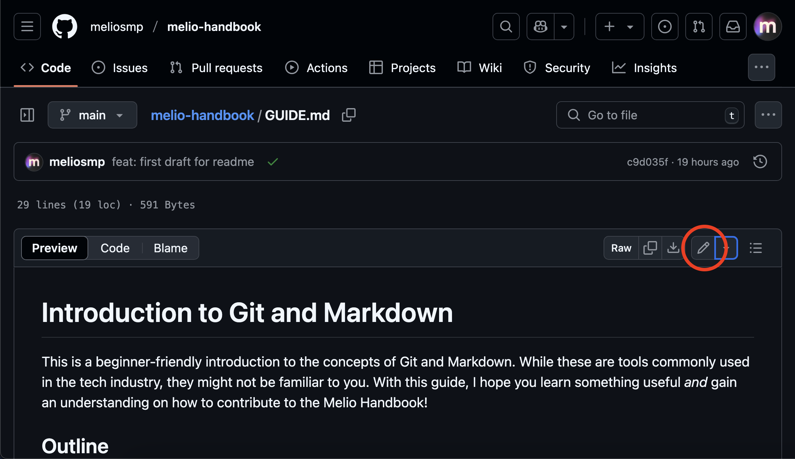
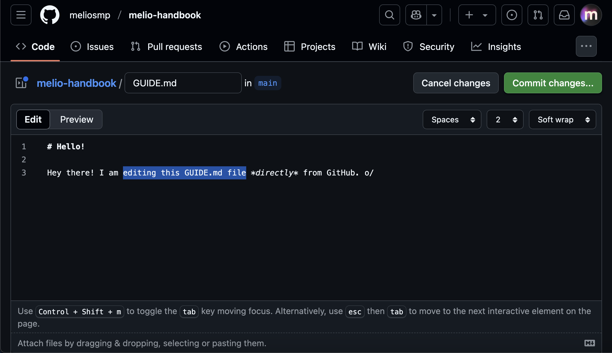
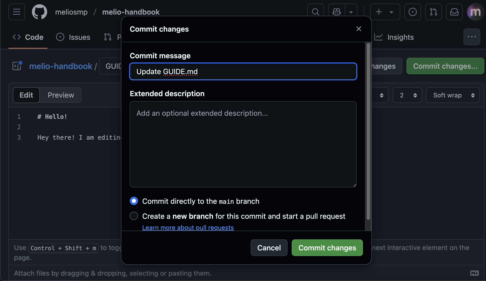

# Introduction to Git and Markdown

> THIS GUIDE IS A WORK IN PROGRESS

This is a beginner-friendly introduction to the concepts of Git and Markdown.
While these are tools commonly used in the tech industry, they might not be
familiar to you. With this guide, I hope you learn something useful *and*
gain an understanding on how to contribute to the Melio Handbook!

## Outline

We will cover the following topics in this introduction:
... TODO

## Git

Git is a version control & tracking system. Simply put, it tracks the changes that you save to your files and allows collaborators to see, compare, or propose changes to those files.

## GitHub

GitHub is a website that used to host and manage code, allowing us collaborate on a centralized repository1. In our case, the "code" in question is our Handbook. 
GitHub repositories operates using Git, a version-tracking system that is used
universally in software development.

To contribute to the Handbook, you will need to [create a GitHub account](https://github.com/signup).

1 : A repository can be thought of as one project or one folder containing code, images, documents, and other files.

## Forking the Repository

TODO

## Editing Files

You can edit files directly on GitHub repositories where you are authorized as a collaborator.
In this case, however, you are not a collaborator on the Melio Handbook so you will not be able to 
edit it *directly* in our repository.

1. Click on the file name of any file in the repository

2. Choose Edit File

3. Make changes to the file inside the editor, then choose Commit Changes when done

4. Click Commit Changes again

## Using Markdown

In step #3 from the previous section, you may be confused as to what exactly to do
inside the file editor. 
It's simple: if the file you're editing ends with `.md`, then you should be using Markdown. 
Markdown is a way to format and style text in a way that's easy to read and write.

Markdown is what Discord also uses! [See this article](https://support.discord.com/hc/en-us/articles/210298617-Markdown-Text-101-Chat-Formatting-Bold-Italic-Underline) 
on more information about how to format text using Markdown. 
Almost every Markdown feature that applies on Discord also works on GitHub.

## Making a Pull Request

Pull Requests can be thought of as proposals. 
You submit your proposed changes to the source repository to be reviewed.
Depending on what the maintainers2 decide, it can either be
rejected, accepted, or you may be asked to make adjustments before it is re-reviewed.

If your changes are final, you can "submit" them to us by making a Pull Request.

TODO

After your Pull Request is made, please inform the maintainers2.
We will review your proposed changes as soon as we can.

2 : Maintainers are the people responsible for maintaining a project (CesiumCat and silw, in this case) and are the ones who will review your Pull Request. 

## What's Next

After your Pull Request is reviewed, we may request you to make 
some adjustments to your Pull Request or simply reject it.
You may see our response on the Pull Request page.

TODO: image example

Alternatively, we may accept your Pull Request after which your proposed changes will be
publicly available on handbook.meliosmp.com!