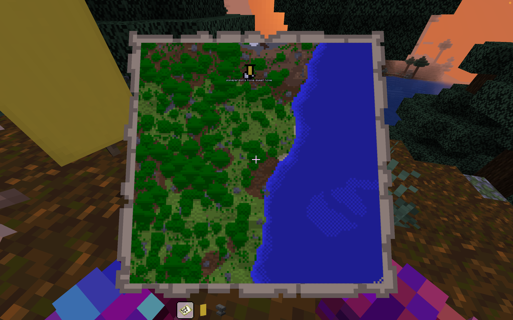
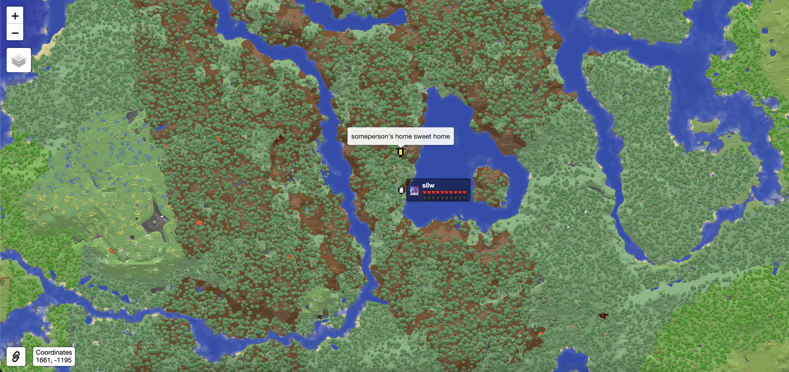
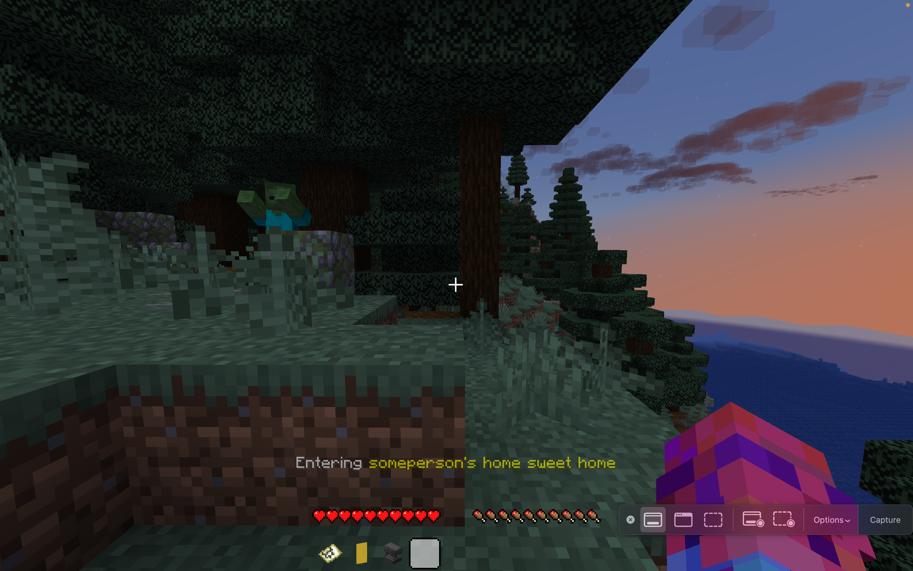
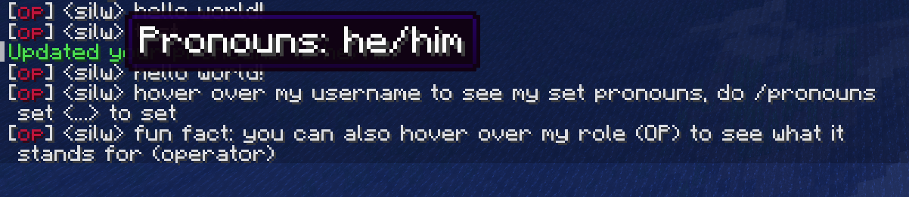
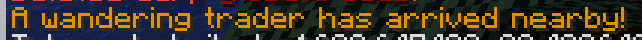
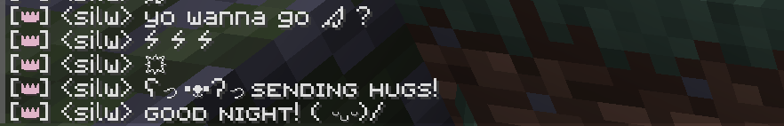

With the world reset around the corner, we *have* to communicate about everything. So it's about time then. This blog post will cover <!-- truncate --> the following:
- Feature Changes
- Market Changes
- Rule Changes
- New Backer Perks
- New World Start Expectations
- New World Start Date

## Feature Changes

### 0) Migration to Fabric
Say goodbye to Paper, and say hello to Fabric! Fabric will allow us to unlock more performance on the server-side and also maintain more parity with true vanilla[^1] Minecraft.

<!-- truncate -->

### 1) Live Map
After dozens of requests for a live map (sometimes referred to as dynmap), it is now here! Powered by [squaremap](https://modrinth.com/plugin/squaremap). Please don't expect the live map below to accurately reflect anything until the new world officially starts.

https://map.meliosmp.com/

### 2) Districts
Districts are large, reserved areas that mandate a particular building style (e.g. medieval). 
You can find banner markers on the live map that define the perimeter of each district.

Please note that if you are eager to collaborate, it's no surprise that we expect you to communicate
with your fellow district mates. We want everyone to try and match the aesthetic in each district!

The Districts will create more opportunity to work together and interact with each other. 
In this post, we also expand on new 'inactivity rules' to make sure that districts can stay fresh.
It's an addition only for those who want to opt-in, and doesn't take away from the vanilla experience. 
Everything outside these districts is free-game, like normal.

<!-- 

List of Districts

1. Medieval District

asdas

2. Fantasy District

...

3. Central City

...

 -->

### 3) Markers
The [banner marker](https://modrinth.com/mod/squaremap-banner) 
is a system that allows the use of banners to create markers visible 
to everyone throughout the live map.

To create a marker in-game, get any `Banner` and rename it as you wish. Place it down, 
and right click on it while holding a `Map` (cannot be empty map). Your marker should now be visible on the live map.

When you walk near the marker, you will get a notification on your action bar as shown below. 
We will be using this mechanism for district markers!

### 4) Resource Worlds
Resource Worlds (including a Resource Nether) are being added to Melio! The Resource Worlds are a second overworld / second nether that will be reset every few months, solely for the purpose of resource-gathering. This is not a convenience feature, but a necessity that we are adding to solve two previous problems at once:
- Difficulty in obtaining non-renewable resources increases over time (e.g. sand, calcite, raw quartz, netherite, diamonds, structures) requiring subsequent expeditions to be further and further from spawn.
- New items from new Minecraft updates being unavailable in a world whose chunks have all been pre-generated or explored (e.g. pale oak wood, creaking heart, and resin when updating to 1.21.4). We cannot continue expanding the world border perpetually, forever...

:::warning
Since the resource worlds are reset every few months, please do NOT build or store anything permanently there. We will not recover lost items from any resource worlds.
:::

More Info

The Resource Worlds will be available *at the earliest* 30 days after the world starts (no fixed dates). You will find a bedrock portal at spawn; walking into it will bring you to the Resource Overworld. The Resource Nether, on the other hand, will be available through a custom obsidian portal *inside* the Resource World. Please note that the following are disabled in the Resource Worlds:
- Nether Portals
- End Portals
- Villager Breeding

### 5) In-game Pronouns
So the bad news is, we couldn't synchronize or link the Discord pronouns roles to the in-game pronouns. 
The good news is, you can now set your pronouns in-game with `/pronouns set <pronouns>`!
Your pronouns will be visible to anyone hovering over your username.

### 6) Wandering Traders & Villagers

Wandering Trader spawning logic has been changed to be per-player instead of global.
Additionally, you will be notified in chat when a wandering trader spawns near you.
You will see why this is important in a few weeks.

Villager lobotomization is currently unavailable (technical issues). However, villager trade discounts are now applied
**globally** instead of per-player. This now means *you* can cure an infected zombie villager, and all your friends can
reap the benefits as well!

### 7) Features being Removed
- The "No lava, fire, or tnt placement" for players with playtime under 2h (technical issue)
- "Uncraft quartz" and "Uncraft wool" recipe
- Recovery Compass upon death
- Otherside plugin
- Most of the funky Paper stuff that breaks redstone machines

## New Economy

:::info
We will have a temporary, pop-up market for the first few weeks.
:::

Since this is part of the reason we decided on a world reset, here is what we'll be doing for the new economy & the new market district:

#### 1) Pricing List

The Philosophy

The economy should focus less on purely competition, as that in itself is unfair. The only way to make the competition fair is through a pricing floor, so that people can focus on building & stocking shops to “do their own thing”.

The Base Pricing List is a spreadsheet that dictates the minimum price for nearly all items in the game. This will be opened to the public *at the earliest* 30 days after the world starts.

#### 2) New Trading Rules

The Philosophy

The purpose of our economy is to function as a stable, reliable system where people can obtain a currency[^3] for goods & services, and obtain goods & services for a currency[^3]. It is not to compete, or to “win” in business. The following rules are in place to ensure this system can operate as intended.

[To read the new trading / market rules, click here](/docs/rules/trading).

## General Rule Changes

[See this Handbook section for more](/docs/rules).

## New Backer Perks

For the backers, we're adding this new quirk in chat where you can type `:zap:` and 
it will show as ⚡️ – and many many more emojis, as well as emoticons!

## World Start Expectations
The server will start in a new vanilla world (no more TerraformGenerator). Since it's a brand new spawn in a brand new world, so let's take care to avoid building any bases within few hundred blocks of spawn to make room for a properly-planned spawn region.

Expect a few things to come *later*: the voting system, the resource world, the pricing list, and the "finalized" market district. The handbook (other than the rules) will also take time to update.

**NO VISITING THE END UNTIL WE FIGHT THE ENDER DRAGON TOGETHER**

## Start Date
The new world will begin at the following date and time. Please note that the timestamp below is displayed in YOUR browser's local timezone (24 hour time format).

<code>🎉 {new Date("21 February, 2025 15:15 GMT").toLocaleString('en-GB', {
  day: 'numeric',
  weekday: 'long',
  month: 'long',
  year: 'numeric',
  hour: '2-digit',
  minute: '2-digit',
  hour12: false
})} 🎉</code>

[^1]: "True Vanilla" here refers to the use of zero plugins, zero mods, and more importantly the default Mojang `server.jar` that is incompatible with any plugins or mods.
[^2]: Staff in this context inclues moderators and admins.
[^3]: The currency in question here is diamonds.